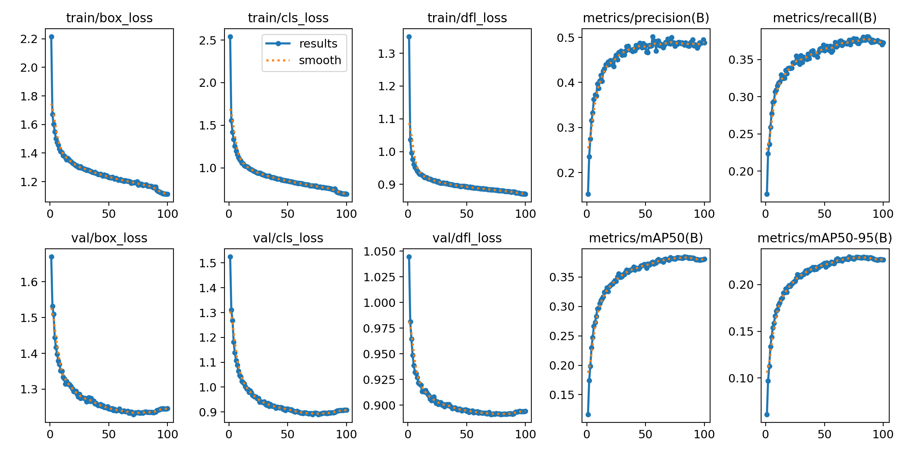
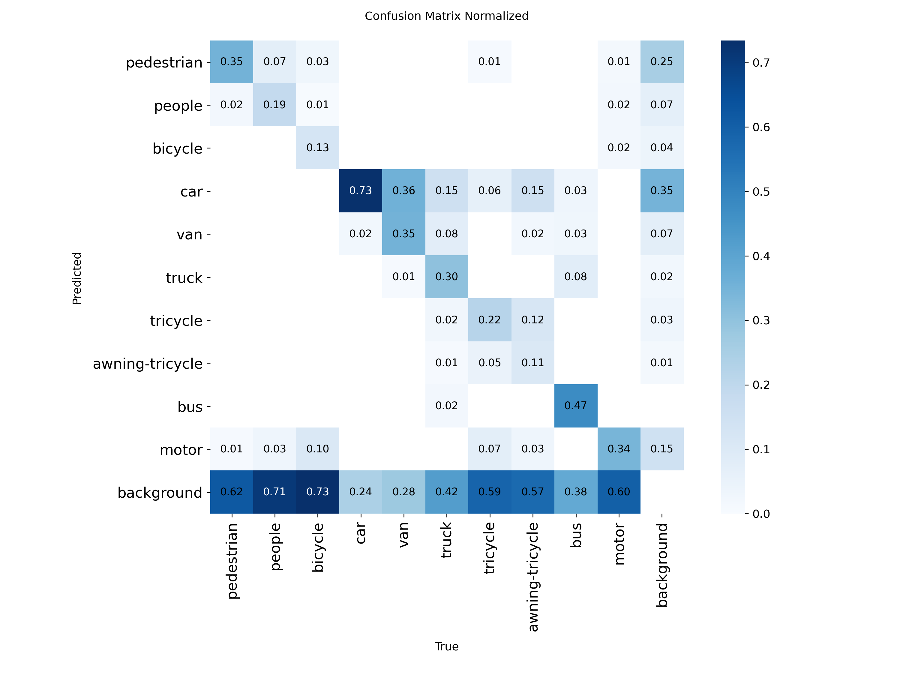
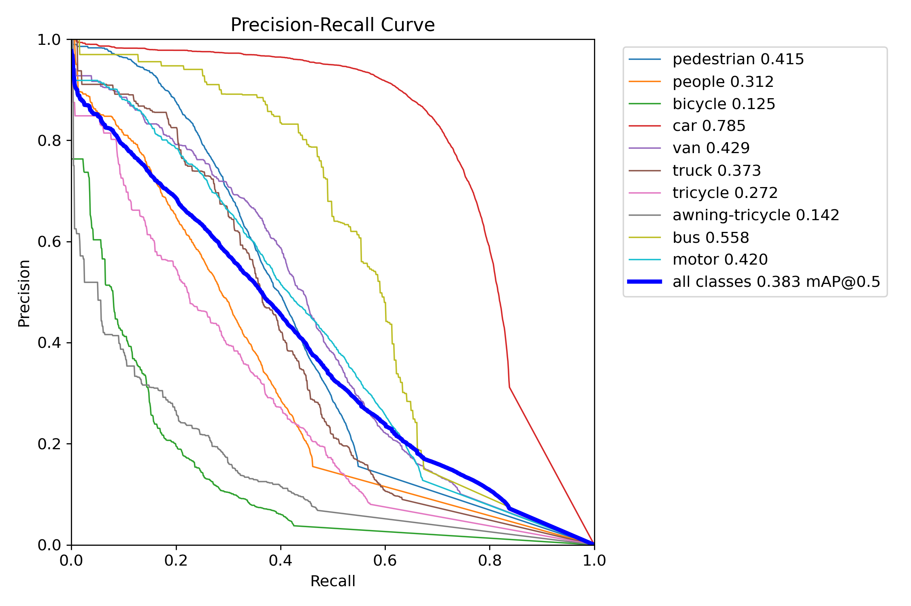

# YOLOv11 VisDrone Fine-Tuning and Evaluation

## 🛠️ Description

This repository contains a set of Python scripts that perform the following tasks:
1. Download the VisDrone dataset using the provided YAML configuration file from the Ultralytics YOLOv11 repository.
2. Fine-tune the YOLOv11s model on the VisDrone dataset.
3. Compare and evaluate the results before and after fine-tuning.

This setup is useful for anyone interested in experimenting with drone-based object detection using the latest YOLOv11 models.

## ⚙️ Languages or Frameworks Used
Main required modules:
- `ultralytics`
    - which includes `torch`, `opencv`, `numpy` and more

All dependencies are listed in `pyproject.toml`
### Installation

**Option 1: Using Poetry**  
This project uses Poetry for dependency management.  
To install dependencies, first make sure Poetry is installed, then run:
```bash
poetry install
```
**Option 2: Using pip**
```bash
pip install $(poetry export --without-hashes --format=requirements.txt)
```

## 🌟 How to run

1️⃣ **Download Dataset**  
- Run the `datasets/download_visDrone_dataset.py`

2️⃣ **Fine-Tune YOLOv11s (Optional)**  
- Run the `train_11s.py`

3️⃣ **Run Object Tracking**  
```bash
python3 main.py
or
poetry run python3 main.py
```

## 🪽 Results

- Train graphs over 100 epochs


- Confusion Matrix of the Newly Trained 11s model




## 🤖 Contributors
- [kmsrogerkim](https://github.com/kmsrogerkim)
- [Seongeun](https://github.com/adsf1780)
- [Doyeon](https://github.com/doyeon0803)
- [Jeonghyun-Kang](https://github.com/Jeonghyun-Kang)
